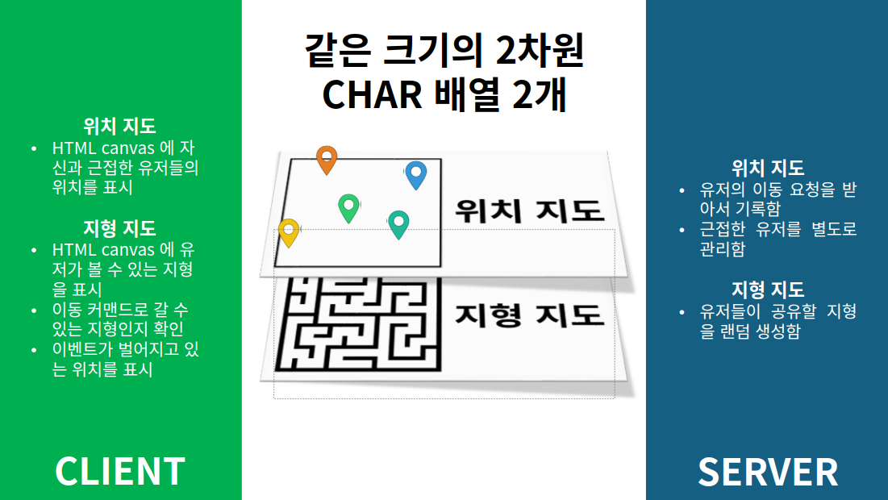
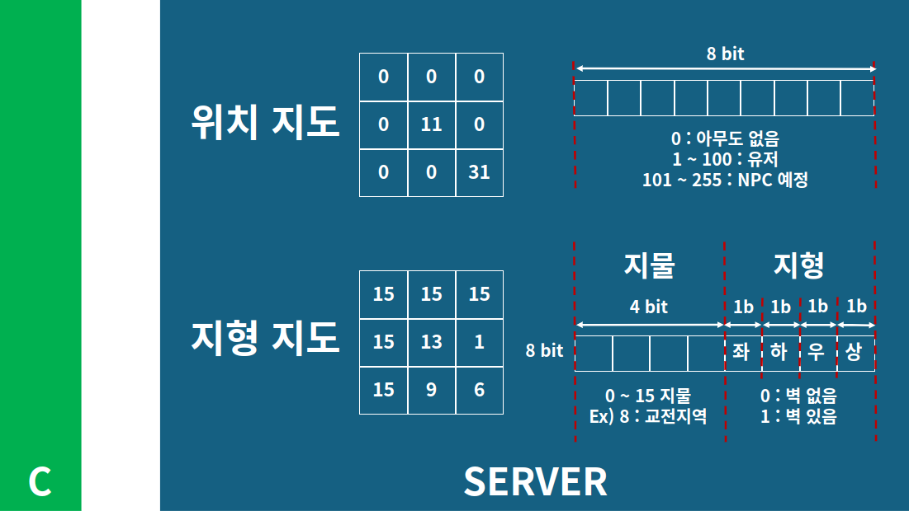
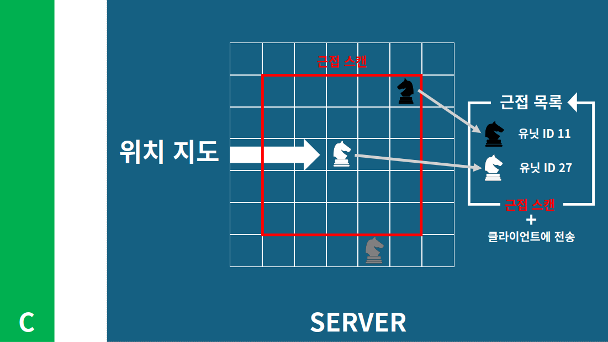
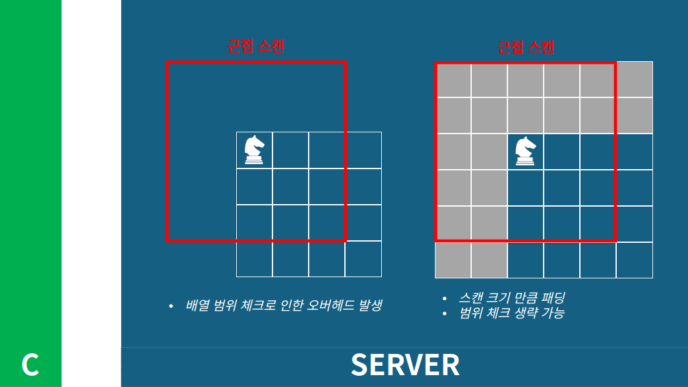
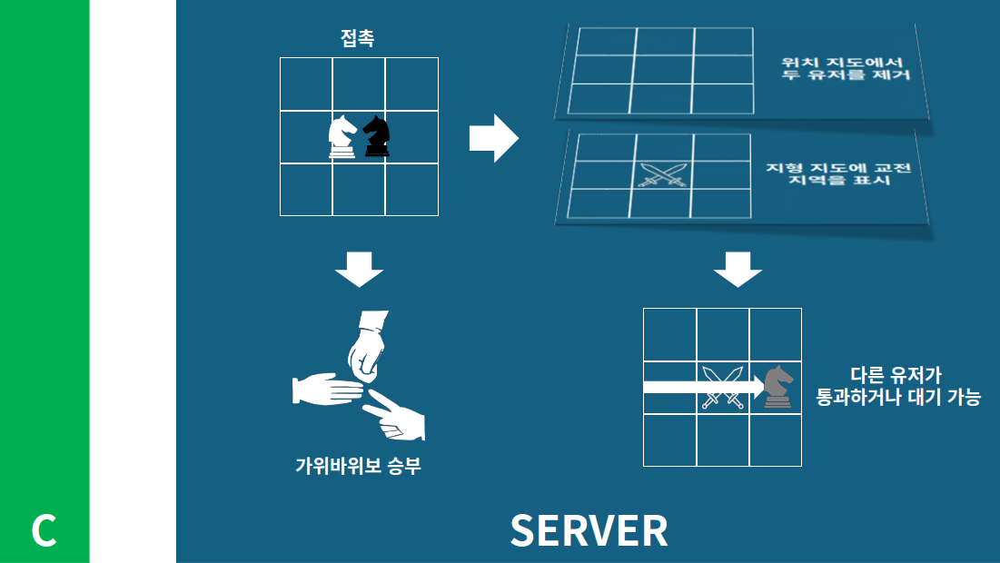
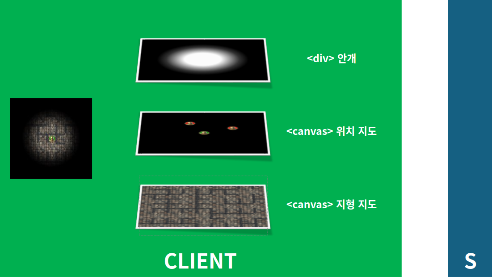
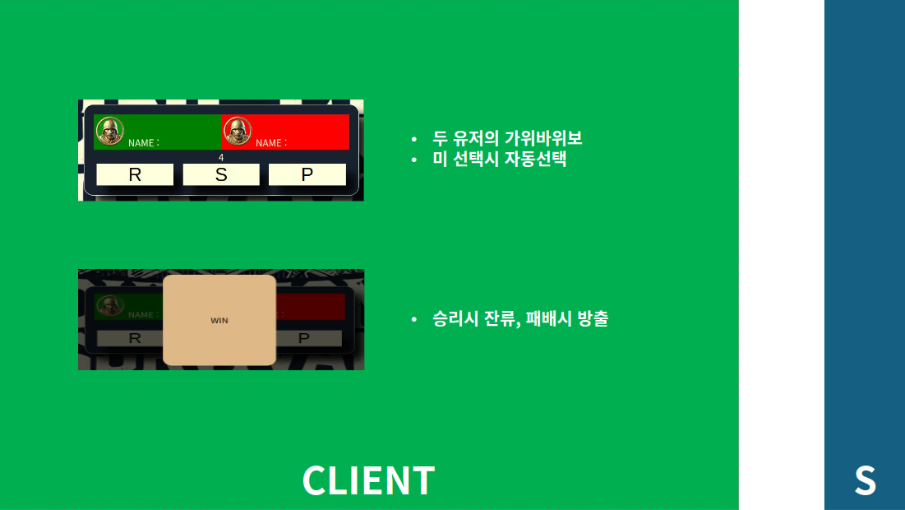

# Dungeon Survival
> 랜덤 생성되는 미로에서 벌여지는 복수의 유저간 생존게임

## 상태
* 진행 : 1단계 완료
* 기간 : 2024.9.3 ~ 2024.9.28
* 인원 : 1명

## 개요
* 1 단계 : n명의 클라이언트가 미로상에서 실시간 이동 가능 
* 2 단계 : 유저간 접촉시, 쌍방 소통 가능한 이벤트 발생

## 개발의의
* websocket을 이용한 실시간 웹게임 서비스를 개발해보며 종합적인 백앤드 실력 향상을 도모한다.
* 같은 자원(지도)을 대상으로 복수의 유저가 잦은 빈도로 보내는 요청을 문제없이 처리할 것

## 구조

## 환경
* **서버**
    * 배포 : AWS(t2.micro)
    * OS : Ubuntu 24.04
    * 언어 : Python

* **클라이언트**
    * H/W : 브라우저

